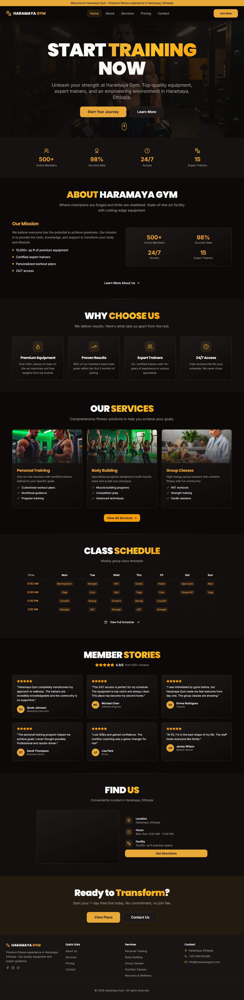
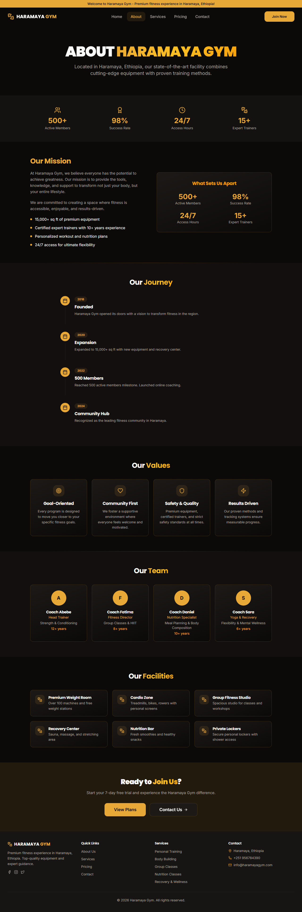
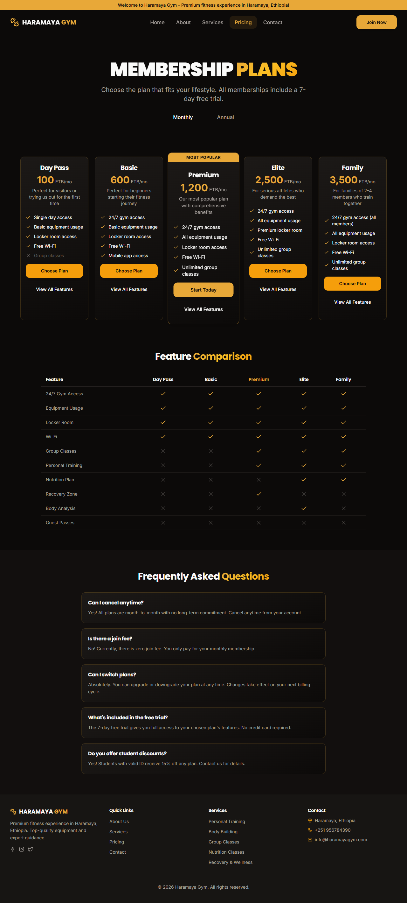
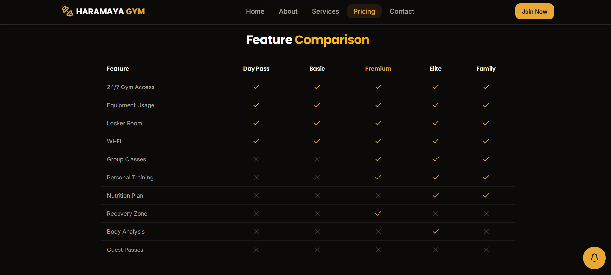
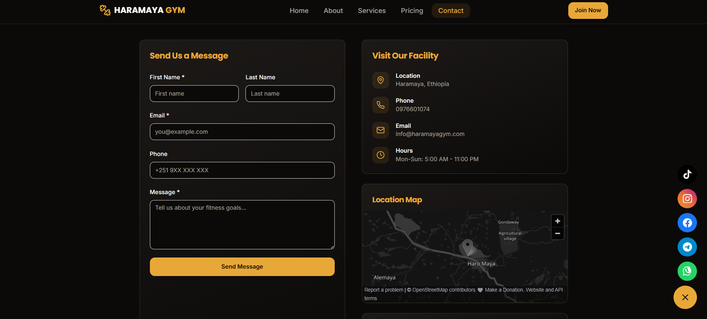

# Haramaya Gym Website

[](https://reactjs.org/)
[](https://www.typescriptlang.org/)
[](https://vitejs.dev/)
[](https://tailwindcss.com/)

The official website for **Haramaya Gym** — a modern, multi-page fitness website built for a premium gym in Haramaya, Ethiopia.

## Live Demo

**[Haramaya Gym Live](https://haramaya-gym.vercel.app)**

## Screenshots

| | |
|:---:|:---:|
| **Home Page** | **About Page** |
|  |  |
| **Services Page** | **Pricing Page** |
|  |  |
| **Pricing Table** | **Contact Page** |
|  |  |

## Pages

| Page | Route | Description |
|------|-------|-------------|
| Home | `/` | Hero, stats, about preview, services, schedule, testimonials, location, CTA |
| About | `/about` | Mission, timeline, values, team, facilities |
| Services | `/services` | 6 services with detail modals (Learn More -> Book Now) |
| Pricing | `/pricing` | 5 plans, monthly/annual toggle, comparison table, FAQ |
| Contact | `/contact` | Contact form, location map, facility info |

## Features

- Multi-page routing with React Router
- Dark premium theme (warm gold + stone black)
- Monthly/Annual pricing toggle with 20% discount
- Service detail modals with Book Now -> Contact page
- Pricing "Choose Plan" -> Contact page navigation
- Responsive mobile navigation with hamburger menu
- Join Now dialog from navbar
- Class schedule timetable
- OpenStreetMap integration
- Smooth scroll animations
- shadcn/ui component library

## Tech Stack

- **React 18** — Frontend framework
- **TypeScript** — Type safety
- **Vite 5** — Build tool & dev server
- **Tailwind CSS 3** — Utility-first styling
- **shadcn/ui** — Pre-built UI components (Radix UI + Tailwind)
- **React Router DOM 6** — Client-side routing
- **Lucide React** — Icons
- **Sonner** — Toast notifications

## Getting Started

### Prerequisites

- Node.js 18+
- npm / yarn / pnpm

### Installation

```bash
git clone https://github.com/gemachistesfaye/Haramaya-Gym.git
cd Haramaya-Gym
npm install
```

### Development

```bash
npm run dev
```

Open [http://localhost:8080/Haramaya-Gym/](http://localhost:8080/Haramaya-Gym/) in your browser.

### Build

```bash
npm run build
```

### Deploy

```bash
npm run deploy
```

## Project Structure

```
src/
  components/
    ui/              # shadcn/ui components
    dialogs/         # Modal dialogs
    NavBar.tsx       # Navigation bar
    Footer.tsx       # Footer
  pages/
    HomePage.tsx     # Landing page
    AboutPage.tsx    # About page
    ServicesPage.tsx # Services page
    PricingPage.tsx  # Pricing page
    ContactPage.tsx  # Contact page
    NotFound.tsx     # 404 page
  data/
    services.ts      # Service data
    plans.ts         # Pricing plan data
  assets/            # Images
```

## Contributing

1. Fork the repo
2. Create a feature branch: `git checkout -b feature/your-feature`
3. Commit changes: `git commit -m "Add feature"`
4. Push: `git push origin feature/your-feature`
5. Open a Pull Request

## Contact

- **[GitHub](https://github.com/gemachistesfaye)**
- **[LinkedIn](https://www.linkedin.com/in/gemachis-tesfaye-137196318)**
- **[Email](mailto:gemachistesfaye36@gmail.com)**
- **[Telegram](https://t.me/urjiiko1)**

---

Stay fit, stay strong, and keep coding!
